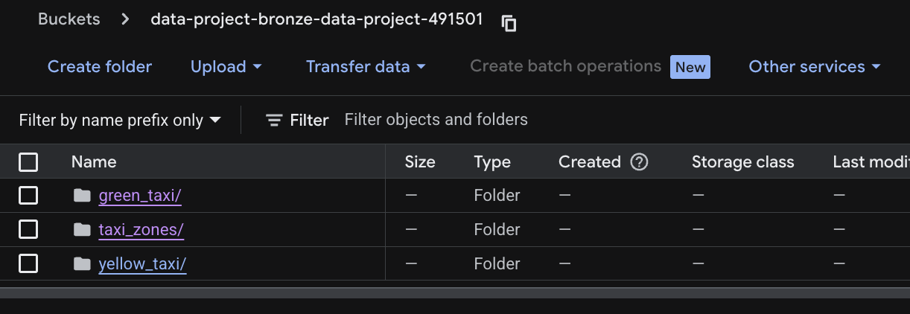
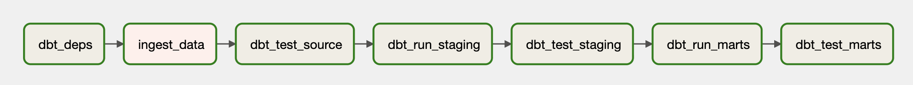
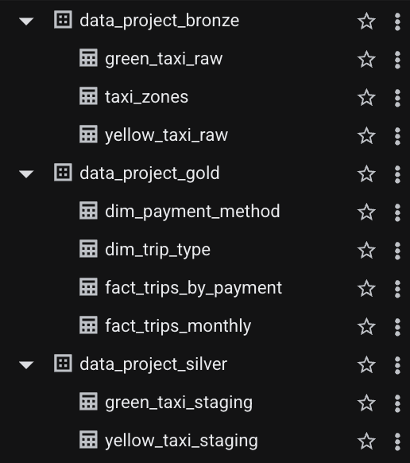

# 🚕 NYC Taxi Lakehouse ETL — Airflow + dbt + BigQuery

> The **ETL & transformation layer** for the NYC Taxi Lakehouse — an end-to-end pipeline that ingests raw **NYC TLC trip records** into **GCS**, validates the bronze sources, and orchestrates **incremental dbt models** through the **Silver** and **Gold** medallion layers in **BigQuery**, all driven by a single **Apache Airflow DAG**.

---

## 📑 Table of Contents

- [🎯 Overview](#-overview)
- [❗ Problem Statement](#-problem-statement)
- [🥉🥈🥇 Medallion Pipeline](#-medallion-pipeline)
- [🛫 Airflow DAG](#-airflow-dag)
- [🛠️ Tech Stack](#-tech-stack)
- [📂 Project Structure](#-project-structure)
- [✅ Prerequisites](#-prerequisites)
- [🚀 Installation & Setup](#-installation--setup)
- [⚙️ Usage](#-usage)
- [🧪 Data Quality & Tests](#-data-quality--tests)
- [📸 Screenshots](#-screenshots)
- [🤝 Contributing](#-contributing)
- [📄 License](#-license)
- [📬 Contact](#-contact)

---

## 🎯 Overview

This repository is the **runtime companion** to the [`data-lakehouse-infra`](../data-lakehouse-infra) Terraform project. While the infra repo provisions the lakehouse footprint (GCS buckets, BigQuery datasets, BigLake connection, IAM), **this repo runs the data through it**. It combines:

- 🐍 **Python ingestion** — pulls monthly **NYC TLC** parquet files (Yellow & Green taxi) and the taxi-zone lookup CSV directly from CloudFront
- 🪣 **GCS partitioned upload** — writes to the bronze bucket using Hive-style paths (`{taxi_type}/year={YYYY}/month={MM}/…`) so BigLake auto-detects partitions
- 🛠️ **dbt incremental models** — staging models in **Silver** use `merge` strategy with auto-generated `pre_hook` table creation, and dimensional/fact models in **Gold** materialize as queryable tables
- 🛫 **Airflow DAG** — schedules the entire pipeline on a monthly cron (`0 2 1 * *`), with retries, dbt tests gating the transform, and a strict task ordering

The result is a **scheduled, idempotent, test-gated pipeline** that turns raw, third-party files into BI-ready fact and dimension tables.

### ❗ Problem Statement

Bringing NYC TLC public data into a usable analytical model usually involves brittle one-off scripts, manually triggered loads, and untested SQL transformations. This project solves that with a **declarative, retryable, incremental pipeline**:

- 🔁 **Idempotent ingestion** — re-running a month overwrites the same partition path, never duplicates
- ✅ **Source contracts** — bronze tables are tested with `not_null` checks before any silver model runs
- 📈 **Incremental transforms** — silver staging and the `fact_trips` gold model use `materialized='incremental'` with `merge` strategy, so dbt only scans the **new month's partition** instead of replaying the full backfill on every run. This keeps monthly runs fast, dramatically cuts BigQuery scan costs, and makes reprocessing a single month idempotent
- 🧱 **Dimensional model in Gold** — payment-method and trip-type dimensions, plus `fact_trips`, `fact_trips_monthly`, and `fact_trips_by_payment`

### 🏆 Key Outcomes

- ✅ **Fully orchestrated** — a single Airflow DAG owns ingestion, testing, and transformation
- 🔁 **Incremental by default** — `merge` strategy on staging, partitioned `fact_trips` table in Gold
- 🧪 **Tested at every layer** — `dbt test --select source:*` blocks bad raw data from reaching Silver
- 💰 **Cost-aware** — Gold facts are partitioned by `pickup_date` (monthly granularity) for query pruning
- 🔌 **Configurable** — taxi types, date range, and credentials are all driven by Airflow Variables

---

## 🥉🥈🥇 Medallion Pipeline

This repo implements the **transformation half** of the medallion architecture defined in the infra repo. Each step below maps to a concrete file you can open and inspect.

```
   ┌──────────────────────┐
   │   NYC TLC CloudFront │   (yellow_tripdata · green_tripdata · taxi_zone_lookup)
   └──────────┬───────────┘
              │ pandas.read_parquet / read_csv
              ▼
   ┌──────────────────────┐           ingestion/ingest_dataset.py
   │   GCS Bronze Bucket  │   ◀─────  upload_to_gcs() with Hive partitions
   │  yellow_taxi/year=…  │
   │  green_taxi/year=…   │
   │  taxi_zones/…        │
   └──────────┬───────────┘
              │ BigLake external tables (provisioned by infra repo)
              ▼
   ┌──────────────────────┐
   │   Bronze (BQ ext)    │   data_project_bronze.{yellow,green}_taxi_raw
   └──────────┬───────────┘
              │ dbt run --select path:models/silver
              ▼
   ┌──────────────────────┐           dbt/models/silver/*.sql
   │   Silver             │   ◀─────  incremental + merge + pre_hook DDL
   │  *_taxi_staging      │           (renamed columns, typed schema)
   └──────────┬───────────┘
              │ dbt run --select path:models/gold
              ▼
   ┌──────────────────────────────────────────────────────────┐
   │   Gold                                                   │
   │  • dim_payment_method · dim_trip_type   (lookup tables)  │
   │  • fact_trips           (partitioned by pickup_date)     │
   │  • fact_trips_monthly   · fact_trips_by_payment          │
   └──────────────────────────────────────────────────────────┘
```

### 🥉 Bronze — Raw Ingestion

Implemented in [`ingestion/ingest_dataset.py`](ingestion/ingest_dataset.py). The `NYCTaxiIngestion` class:

- Pulls parquet from `https://d37ci6vzurychx.cloudfront.net/trip-data/{yellow|green}_tripdata_{YYYY}-{MM}.parquet`
- Pulls the [taxi zone lookup CSV](https://d37ci6vzurychx.cloudfront.net/misc/taxi_zone_lookup.csv)
- Writes to `gs://{bucket}-{project_id}/{taxi_type}/year={YYYY}/month={MM}/{taxi_type}_{YYYY}-{MM}.parquet`
- Logs every download and upload, raises on upload failure

The bronze BigLake external tables (`yellow_taxi_raw`, `green_taxi_raw`, `taxi_zones`) are **defined in the infra repo** and read directly from these GCS paths — no copy, no duplication.

### 🥈 Silver — Cleaned & Typed

Implemented in [`dbt/models/silver/`](dbt/models/silver/):

| Model | Materialization | Strategy | Notes |
|---|---|---|---|
| [`yellow_taxi_staging.sql`](dbt/models/silver/yellow_taxi_staging.sql) | `incremental` | `merge` on `(vendor_id, tpep_pickup_datetime, tpep_dropoff_datetime, pu_location_id, do_location_id)` | CTE pipeline: rename source columns → dedupe via `SUM(...) GROUP BY ALL` → drop trips with `trip_distance ≤ 0` or `total_amount ≤ 0` → stamp `created_at` |
| [`green_taxi_staging.sql`](dbt/models/silver/green_taxi_staging.sql) | `incremental` | `merge` on `(vendor_id, lpep_pickup_datetime, lpep_dropoff_datetime, pu_location_id, do_location_id)` | Same CTE/dedupe/quality pattern; preserves `ehail_fee` & `trip_type` |

Three pieces of logic worth calling out in the silver layer:

- 🧮 **Deduplication by aggregation** — natural key columns are grouped, all measures are wrapped in `SUM(...)`, and `GROUP BY ALL` collapses any duplicate rows that may exist in the bronze parquet files.
- 🚧 **Quality filter** — `WHERE trip_distance > 0 AND total_amount > 0` drops obviously-broken rows before they reach Gold.
- 🕒 **Audit column** — every silver and gold row is stamped with `created_at = current_timestamp()` so downstream debugging can tie a row back to the run that produced it.

**Pre-hook DDL safety:** every incremental and table model declares a `pre_hook` macro that runs `CREATE TABLE IF NOT EXISTS` with the canonical schema before each run — preventing first-run failures and keeping `{{ this }}` resolvable on day one. The full set lives in [`dbt/macros/create_table_if_not_exists.sql`](dbt/macros/create_table_if_not_exists.sql):

| Model | Macro |
|---|---|
| `yellow_taxi_staging` | `create_yellow_taxi_staging()` |
| `green_taxi_staging` | `create_green_taxi_staging()` |
| `fact_trips` | `create_fact_trips()` (includes `PARTITION BY DATE_TRUNC(pickup_date, MONTH)`) |
| `fact_trips_monthly` | `create_fact_trips_monthly()` |
| `fact_trips_by_payment` | `create_fact_trips_by_payment()` |

**Incremental window:** `WHERE (year * 100 + month) > MAX(year * 100 + month)` — only new monthly partitions are processed. Override via `--vars '{"start_year_month": 202401}'`.

### 🥇 Gold — Curated & BI-Ready

Implemented in [`dbt/models/gold/`](dbt/models/gold/):

| Model | Type | Description |
|---|---|---|
| [`dim_payment_method.sql`](dbt/models/gold/dim_payment_method.sql) | Dimension | Static lookup: 6 payment methods (Credit Card, Cash, …) |
| [`dim_trip_type.sql`](dbt/models/gold/dim_trip_type.sql) | Dimension | Static lookup: Street-hail · Dispatch |
| [`fact_trips.sql`](dbt/models/gold/fact_trips.sql) | **Fact (incremental, partitioned)** | Overrides the `gold: +materialized: table` default with `incremental` + `merge`. UNION ALL of yellow + green; `pickup_date` partitioned monthly; surrogate `trip_id` via `dbt_utils.generate_surrogate_key` over `(vendor_id, *_pickup_datetime, *_dropoff_datetime, pu_location_id, do_location_id)` |
| [`fact_trips_monthly.sql`](dbt/models/gold/fact_trips_monthly.sql) | Aggregate (`table`) | Trips, passengers, distance, fare, tip, revenue, avg duration — by `(year, month, taxi_type)` |
| [`fact_trips_by_payment.sql`](dbt/models/gold/fact_trips_by_payment.sql) | Aggregate (`table`) | Trip counts & revenue grouped by payment method. NULL `payment_type` is coalesced to `7` so it joins cleanly with the new `Others` row in `dim_payment_method` |

---

## 🛫 Airflow DAG

The orchestration entrypoint is [`main_airflow.py`](main_airflow.py), defining the DAG **`nyc_taxi_etl`**.

### ⏰ Schedule & Defaults

```python
schedule_interval = '0 2 1 * *'   # 02:00 on the 1st of every month
catchup           = False
retries           = 2
retry_delay       = 5 minutes
start_date        = 2024-01-01
```

### 🔗 Task Graph

```
  dbt_deps ─▶ ingest_data ─▶ dbt_test_source
           ─▶ dbt_run_staging ─▶ dbt_test_staging
           ─▶ dbt_run_marts   ─▶ dbt_test_marts
```

| Task | Operator | Purpose |
|---|---|---|
| `dbt_deps` | `BashOperator` | `dbt deps` — installs `dbt-labs/dbt_utils@1.1.1` |
| `ingest_data` | `PythonOperator` | Runs `NYCTaxiIngestion.ingest_all(...)` |
| `dbt_test_source` | `BashOperator` | `dbt test --select source:*` — fails the DAG if bronze is dirty |
| `dbt_run_staging` | `BashOperator` | `dbt run --select path:models/silver` |
| `dbt_test_staging` | `BashOperator` | `dbt test --select path:models/silver` — gates Gold builds on Silver quality |
| `dbt_run_marts` | `BashOperator` | `dbt run --select path:models/gold` |
| `dbt_test_marts` | `BashOperator` | `dbt test --select path:models/gold` — final quality gate before run completes |

### 🎛️ Configuration via Airflow Variables

The DAG reads these variables (with safe defaults) — set them once in **Admin → Variables**:

| Variable | Default | Purpose |
|---|---|---|
| `GCP_PROJECT_ID` | `your-gcp-project-id` | Target GCP project |
| `GCS_BUCKET_NAME` | `data-project-bronze` | Bronze bucket prefix (suffixed with `-{project_id}` at runtime) |
| `GCP_CREDENTIALS_PATH` | `None` | Optional SA key path; omit to use the GCE metadata server |
| `TAXI_TYPES` | `yellow,green` | Comma-separated list |
| `INGESTION_START_YEAR` / `INGESTION_START_MONTH` | `2024` / `1` | Inclusive lower bound |
| `INGESTION_END_YEAR` / `INGESTION_END_MONTH` | `2024` / `2` | Inclusive upper bound |
| `INCLUDE_TAXI_ZONES` | `True` | Whether to refresh the zone lookup CSV |

---

## 🛠️ Tech Stack

| Layer | Technology |
|---|---|
| 🛫 **Orchestration** | Apache Airflow |
| 🐍 **Ingestion** | Python · `pandas` · `pyarrow` · `google-cloud-storage` |
| 🛠️ **Transformations** | dbt (with `dbt-labs/dbt_utils@1.1.1`) |
| 🗄️ **Warehouse** | BigQuery (target: `prod`, location `asia-southeast1`) |
| 🪣 **Lake Storage** | Google Cloud Storage |
| 🔌 **Airflow Providers** | `apache-airflow-providers-google` |
| 🔐 **Auth** | OAuth (dbt) · ADC / service-account JSON (Airflow) |
| 🧰 **Source Data** | NYC TLC public CloudFront distribution |

---

## 📂 Project Structure

```
data-lakehouse-etl/
├── 🛫 main_airflow.py                 # Airflow DAG: nyc_taxi_etl
├── 📄 requirements.txt                # pandas · pyarrow · GCS · airflow-providers-google
├── 📄 .gitignore
├── 📂 ingestion/                      # Bronze ingestion package
│   ├── __init__.py
│   └── 🐍 ingest_dataset.py           # NYCTaxiIngestion class
├── 📂 dbt/                            # dbt project: lakehouse_dbt
│   ├── 📄 dbt_project.yml             # silver=incremental · gold=table
│   ├── 📄 profiles.yml                # BigQuery · OAuth · asia-southeast1
│   ├── 📄 packages.yml                # dbt_utils 1.1.1
│   ├── 📂 models/
│   │   ├── 📄 schema.yml              # Sources, model docs, tests
│   │   ├── 📂 silver/
│   │   │   ├── yellow_taxi_staging.sql
│   │   │   └── green_taxi_staging.sql
│   │   └── 📂 gold/
│   │       ├── dim_payment_method.sql
│   │       ├── dim_trip_type.sql
│   │       ├── fact_trips.sql
│   │       ├── fact_trips_monthly.sql
│   │       └── fact_trips_by_payment.sql
│   └── 📂 macros/
│       ├── create_table_if_not_exists.sql   # pre_hook DDL for all 5 incremental/table models
│       └── generate_schema_name.sql         # honors literal schema names
└── 📄 README.md
```

---

## ✅ Prerequisites

- 🐍 **Python** `>= 3.9`
- 🛫 **Apache Airflow** (the project assumes the [`data-lakehouse-infra`](../data-lakehouse-infra) Compose stack)
- 🛠️ **dbt-bigquery** (installed inside the Airflow image)
- ☁️ A GCP project with:
  - The bronze / silver / gold BigQuery datasets provisioned (via the infra repo)
  - The bronze GCS bucket reachable by Airflow's service account
- 🔑 Either OAuth (`gcloud auth application-default login`) **or** a service-account JSON mounted into Airflow

---

## 🚀 Installation & Setup

### 1️⃣ Clone the Repository

```bash
git clone https://github.com/<your-username>/data-lakehouse-etl.git
cd data-lakehouse-etl
```

### 2️⃣ Provision the Infrastructure First

This pipeline **depends on** the bronze/silver/gold datasets and bronze bucket created by the sibling infra repo. Run that one first:

```bash
cd ../data-lakehouse-infra
terraform apply -var-file="variables.json"
```

### 3️⃣ Install Python Dependencies (local dev)

```bash
python -m venv venv
source venv/bin/activate
pip install -r requirements.txt
pip install dbt-bigquery
```

### 4️⃣ Configure dbt Profile

[`dbt/profiles.yml`](dbt/profiles.yml) ships with an active `dev` target pointing at `your-gcp-project-id`, plus a commented-out `prod` block as a template for promotion. Update `project` and `dataset` to match your GCP project, then authenticate:

```bash
gcloud auth application-default login
cd dbt && dbt debug --profiles-dir . --project-dir .
```

### 5️⃣ Drop the DAG into Airflow

Place [`main_airflow.py`](main_airflow.py) and the [`ingestion/`](ingestion/) and [`dbt/`](dbt/) directories under your Airflow `dags/` folder (or the path your Compose stack mounts). The infra repo's Airflow image expects them at `/opt/airflow/dags/` and `/opt/airflow/dbt/`.

### 6️⃣ Set Airflow Variables

In **Airflow UI → Admin → Variables**, create the keys listed in the [DAG configuration table](#-configuration-via-airflow-variables).

---

## ⚙️ Usage

### ▶️ Trigger the DAG Manually

```bash
airflow dags trigger nyc_taxi_etl
```

Or click **▶️ Trigger DAG** in the Airflow UI.

### 🔁 Backfill a Date Range

Update `INGESTION_START_YEAR`/`MONTH` and `INGESTION_END_YEAR`/`MONTH` Airflow Variables, then trigger the DAG. The ingestion class iterates inclusively from start → end and writes one parquet per month.

### 🛠️ Run dbt Locally Against Production

```bash
cd dbt
dbt deps
dbt test --select source:*
dbt run  --select path:models/silver
dbt run  --select path:models/gold
dbt test
```

### ⏪ Re-run a Specific Month Through Silver

Use the `start_year_month` variable (consumed by both staging models) to force a window:

```bash
dbt run --select yellow_taxi_staging --vars '{"start_year_month": 202401}'
```

This replays from `202402` onward, instead of `MAX(year*100 + month)` from the existing target table.

### 📊 Sample Gold Query

```sql
SELECT
  year,
  month,
  taxi_type,
  total_trips,
  total_revenue,
  avg_trip_duration_minutes
FROM `your-gcp-project-id.data_project_gold.fact_trips_monthly`
WHERE year = 2024
ORDER BY year, month, taxi_type;
```

---

## 🧪 Data Quality & Tests

Tests are declared in [`dbt/models/schema.yml`](dbt/models/schema.yml) and gate the DAG via the `dbt_test_source` task.

### 🔬 Source Tests (Bronze)

- `not_null` on critical columns: `VendorID`, pickup/dropoff timestamps, `trip_distance`, `payment_type`

### ✅ Model Tests (Silver & Gold)

Both layers are tested **inside the DAG** — `dbt_test_staging` runs after Silver builds, `dbt_test_marts` runs after Gold builds. Either failing aborts the run before bad data propagates.

**🥈 Silver — `dbt_test_staging`** (after `dbt_run_staging`)

- `not_null` on staging natural-key columns: `vendor_id`, `tpep_pickup_datetime` / `lpep_pickup_datetime`, `tpep_dropoff_datetime` / `lpep_dropoff_datetime`, `trip_distance` (column names retain the `tpep_*` / `lpep_*` source prefix at this layer; the rename to `pickup_datetime` / `dropoff_datetime` happens in `fact_trips`)

**🥇 Gold — `dbt_test_marts`** (after `dbt_run_marts`)

- `accepted_values` on `dim_payment_method.payment_method_name` (`Credit Card` · `Cash` · `No Charge` · `Dispute` · `Unknown` · `Voided Trip` · `Others`) — the `Others` bucket (id `7`) is the join target for NULL `payment_type` rows surfaced from the bronze layer
- `accepted_values` on `dim_trip_type.trip_type_name` (Street-hail · Dispatch)
- `accepted_values` on `fact_trips.taxi_type` (`yellow` · `green`)
- `not_null` on `fact_trips.{trip_id, pickup_date, year, month, taxi_type}`
- `not_null` + `accepted_values` on `fact_trips_monthly` and `fact_trips_by_payment` taxi_type

Run all tests locally:

```bash
cd dbt
dbt test --profiles-dir . --project-dir .                       # all layers
dbt test --select path:models/silver --profiles-dir . --project-dir .   # Silver only
dbt test --select path:models/gold   --profiles-dir . --project-dir .   # Gold only
```

### 💡 Suggested: Soda Core for Richer Validation

dbt tests cover schema contracts. For **freshness**, **distribution drift**, and **cross-fact reconciliation**, [Soda Core](https://docs.soda.io/soda-core/overview-main.html) can be layered in as `soda_scan_{bronze,silver,gold}` `BashOperator` tasks gating the DAG alongside dbt.

---

## 📸 Screenshots

*Hive-partitioned parquet files in the bronze bucket.*



*The `nyc_taxi_etl` DAG: deps → ingest → test → silver → gold.*



*Bronze, silver, & gold layer in BigQuery.*



---

## 🤝 Contributing

Contributions are very welcome — this repo is intentionally small and easy to extend.

1. 🍴 Fork the project
2. 🌿 Create your feature branch (`git checkout -b feature/AmazingFeature`)
3. 💾 Commit your changes (`git commit -m 'feat: add some AmazingFeature'`)
4. 📤 Push to the branch (`git push origin feature/AmazingFeature`)
5. 🔃 Open a Pull Request

Before submitting, please run `dbt test` locally and confirm the DAG parses cleanly with `python -c "import main_airflow"`.

---

## 📄 License

Distributed under the **MIT License**. See [`LICENSE`](LICENSE) for more information.

> ⭐ If you find this project useful, please consider giving it a star — it pairs naturally with [`data-lakehouse-infra`](../data-lakehouse-infra) for a complete IaC + ETL portfolio piece.
